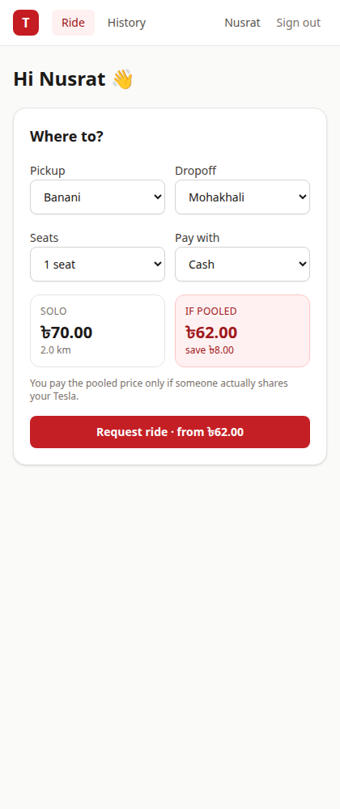
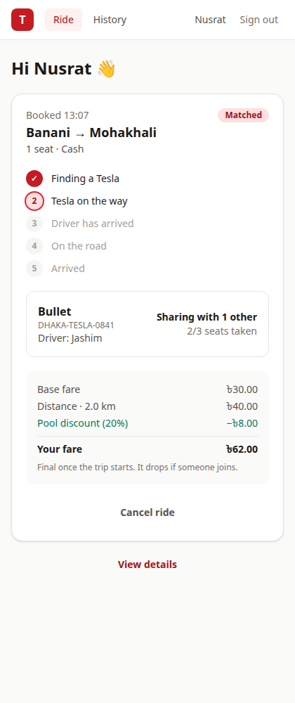
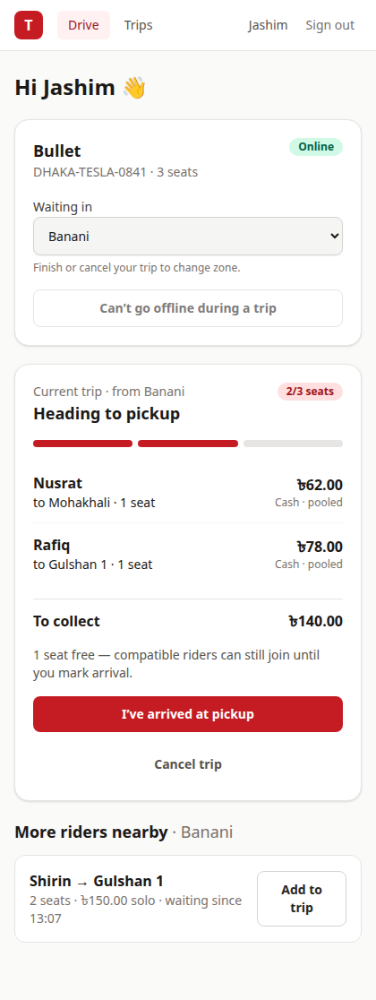
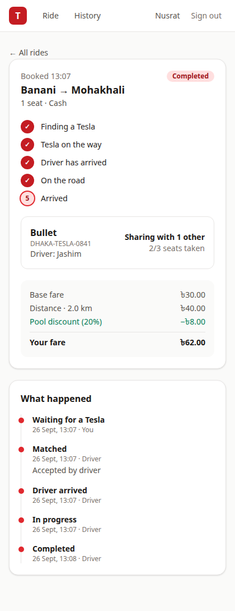
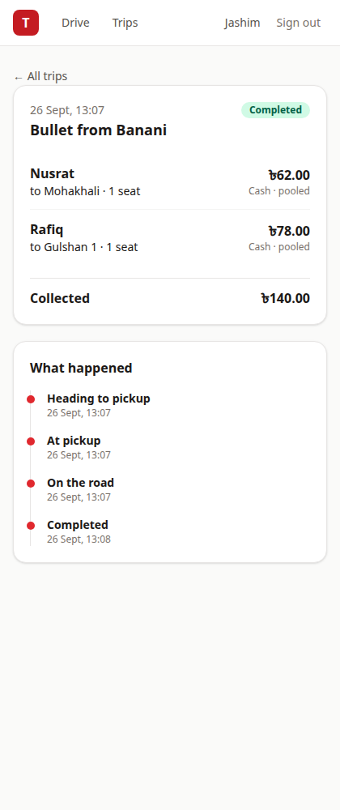
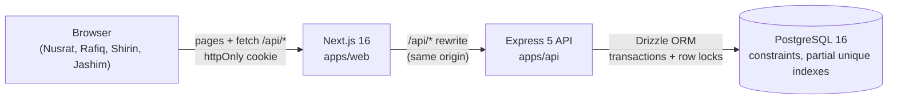
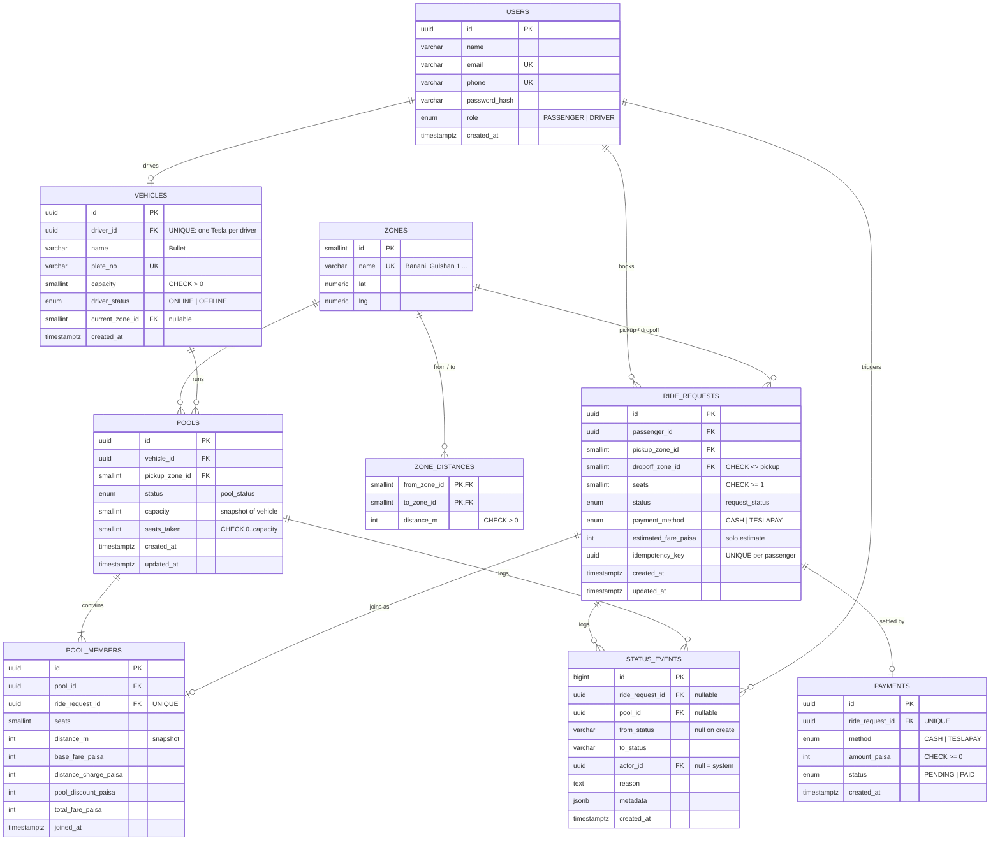

# Dhaka Tesla Pool

_Share a seat. Split the fare. Survive Dhaka traffic._

**▶ [Demo video: problem, architecture and product tour (6 min)](https://drive.google.com/file/d/1c1mGOtmp8MK9E6D2setO8hfu8b4AVsA4/view?usp=sharing)**

A ride-pooling MVP for Dhaka's three-wheeled "Teslas". Passengers request a ride between city zones;
compatible requests share one Tesla; every passenger sees and pays their own fair, hand-checkable
fare; the driver sees exactly who is riding and moves the trip through its stages.

|                    |                                                                                                                                                                       |
| ------------------ | --------------------------------------------------------------------------------------------------------------------------------------------------------------------- |
| **Live demo**      | <https://dhaka-tesla-one.vercel.app> — API health: <https://dhaka-tesla-api-g6an.onrender.com/health> (first load after idle can take ~30–60 s: free-tier cold start) |
| **Demo video**     | [Watch the 6-minute walkthrough](https://drive.google.com/file/d/1c1mGOtmp8MK9E6D2setO8hfu8b4AVsA4/view?usp=sharing)                                                  |
| **Run it locally** | `cp .env.example .env && docker compose up --build` → <http://localhost:3000>                                                                                         |
| **Demo accounts**  | Nusrat, Rafiq, Shirin (passengers) and Jashim (driver of Bullet) — [below](#demo-accounts)                                                                            |

## The problem, in short

At 8:41 in Banani, Nusrat wants Mohakhali and Rafiq wants Gulshan 1. Jashim's Bullet has three
seats. The system has to decide — in about a second, and correctly even when people tap at the same
moment — whether they can share, what each of them pays, and what happens when Shirin wants the last
seat too. Jashim needs to know who is actually riding; each passenger should see only their own fare
and status; and afterwards the system must be able to explain exactly what happened.

The hard parts are not the screens. They are: **never overbooking a seat under concurrency**, a
**clear lifecycle** when one trip holds several independent passengers, **fares anyone can check by
hand**, and **a history that explains every change**.

## What's implemented

**Passenger** — sign up / sign in; pick pickup, dropoff and seats and see a live quote (solo price
and pooled price); request a ride (idempotent, so a double tap never books twice); get auto-matched
into a compatible Tesla; watch status update live (waiting → matched → driver arrived → on the road
→ completed); see your own fare breakdown and how many people you share with (never who they are or
what they pay); cancel until the trip starts; ride history with a per-ride timeline.

**Driver** — sign in; go online/offline in a zone; see waiting requests, oldest first; accept a
request (starts a trip) or add it to the current trip while still heading to pickup; see each rider's
dropoff, seats, fare and payment method; arrive → start → complete, one button per stage; cancel with
a reason; trip history with timelines. Can't go offline or change zone mid-trip.

**Pool / system** — several requests share one Tesla; occupied seats can never exceed capacity (even
under concurrent requests — [tested](#concurrency-the-last-seat)); individual fares, re-priced when
someone joins or leaves and frozen when the trip starts; two explicit state machines; every
transition audited; simulated Cash/TeslaPay payment on completion.

## Screenshots

| Booking with a live quote                                                                        | Pooled: Nusrat's view                                                                                                 | Jashim's current trip                                                                                      |
| ------------------------------------------------------------------------------------------------ | --------------------------------------------------------------------------------------------------------------------- | ---------------------------------------------------------------------------------------------------------- |
|  |  |  |

| Nusrat's ride timeline                                                                                          | Jashim's completed trip                                                                      |
| --------------------------------------------------------------------------------------------------------------- | -------------------------------------------------------------------------------------------- |
|  |  |

## Architecture



One frontend, one API, one database — no Redis, queues or WebSockets, because nothing at MVP scale
needs them ([what changes at scale](docs/scaling.md)). The browser only talks to the Next.js origin,
which forwards `/api/*` to the API, so the session cookie is first-party and there is no CORS.
Inside the API: routes (validate with Zod) → services (business rules, transactions) → Drizzle →
Postgres, with every integrity rule enforced both in a service (for a clear error) and in the
database (so a bug or race can't write a bad row). Details: [docs/architecture.md](docs/architecture.md).

### Database (ERD)



Every table, constraint and index is explained in [docs/erd.md](docs/erd.md). In short:
`ride_requests` hold **per-passenger** status, `pools` hold **per-trip** status, `pool_members`
joins them and stores each passenger's fare breakdown, and `status_events` is the append-only audit
log written in the same transaction as every transition.

## Tech stack and why

| Area          | Picked                                                                      | Realistic alternatives                  | Why it fits this MVP                                                                                                                                                                        | What would make us switch                                                             |
| ------------- | --------------------------------------------------------------------------- | --------------------------------------- | ------------------------------------------------------------------------------------------------------------------------------------------------------------------------------------------- | ------------------------------------------------------------------------------------- |
| Frontend      | **Next.js 16** (App Router), React 19                                       | Vite + React Router                     | Mandated React; App Router gives routing, and its rewrites give the same-origin `/api` proxy that keeps the auth cookie first-party                                                         | Needing a mobile app (→ React Native sharing the API)                                 |
| Styling       | **Tailwind CSS v4**                                                         | CSS Modules, a component library        | Fast to build clean, consistent UI with no design system to maintain                                                                                                                        | A real design system → component library                                              |
| Data fetching | **TanStack Query**                                                          | SWR, hand-written hooks                 | Polling a live ride, cache invalidation after actions, retries and loading/error states out of the box                                                                                      | Moving to WebSockets would reduce it to a cache                                       |
| Backend       | **Express 5** + TypeScript                                                  | NestJS, Fastify                         | Small, explicit, easy to read and explain; Express 5 forwards async errors to one error handler. NestJS's modules/DI are ceremony at this size                                              | Many more modules/teams → NestJS for structure; raw throughput → Fastify              |
| API style     | **REST**                                                                    | GraphQL, tRPC                           | A handful of resources with actions (`POST /pools/:id/start`); HTTP status codes carry outcomes (409 lost race, 422 rule broken)                                                            | Many clients needing different shapes of the same data → GraphQL                      |
| Validation    | **Zod 4**                                                                   | Joi, class-validator                    | One schema gives parsing, normalisation (phones, emails) and types                                                                                                                          | —                                                                                     |
| Database      | **PostgreSQL 16**                                                           | MySQL, SQLite                           | Row locks (`SELECT … FOR UPDATE`), CHECK constraints and partial unique indexes are exactly what capacity and lifecycle integrity need; SQLite's single-writer model hides concurrency bugs | Location/heartbeat volume → move that data to Redis; keep Postgres for rides          |
| ORM           | **Drizzle** + drizzle-kit                                                   | Prisma, Knex/raw SQL                    | Close to SQL (row locks, `sql` fragments), and CHECKs / partial indexes are declared in the schema instead of hand-edited migrations                                                        | A team that prefers Prisma's DX, accepting raw SQL for locking                        |
| Auth          | **JWT (jose) in an httpOnly cookie**, bcrypt                                | Server sessions table, NextAuth/Auth.js | Stateless API, no session store to run; httpOnly + SameSite=Lax limits XSS and CSRF                                                                                                         | Need to revoke sessions instantly → short-lived tokens + refresh, or a sessions table |
| Tests         | **Vitest** + Supertest against real Postgres                                | Jest, mocks                             | The risky behaviour (locks, constraints, races) only shows up against a real database                                                                                                       | —                                                                                     |
| Hosting       | **Vercel** (web) + **Render** (API, Docker) + **Neon** (Postgres), all free | Fly.io, Railway, one VPS                | Free tiers; Render runs the same Docker image we test locally                                                                                                                               | Cold starts matter → paid always-on instance                                          |

## Project structure

```
apps/
  api/                      Express API
    src/
      config/env.ts         validated environment (fails fast)
      db/                   Drizzle schema, client, migrate + seed scripts
      modules/
        auth/               register, login, logout, /me
        rides/              passenger ride requests, history, cancel
        pools/              matching, seat claims, fares, trip lifecycle
        driver/             online status, request feed, driver routes
        fares/              pure fare model (integer paisa)
        lifecycle/          the two state machines + audited transitions
        zones/              zones and distances
      middleware/           auth/role guards, validation, error handler
    drizzle/                generated SQL migrations
    tests/                  integration + unit tests (real Postgres)
    Dockerfile
  web/                      Next.js app
    src/app/                routes: /login, /register, /ride/*, /drive/*
    src/components/         ui kit, ride/*, drive/*
    src/lib/                api client, query hooks, formatting, types
    Dockerfile
docs/                       architecture, ERD, lifecycle, pooling & fares, deployment, scaling
docker-compose.yml          db + api + web with healthchecks
render.yaml                 Render blueprint for the API
```

## Running it

### Prerequisites

- Docker with Compose v2 (for the one-command run)
- For local development: Node.js 22 (22.13+ recommended) and npm 10

### With Docker (recommended)

```bash
cp .env.example .env
docker compose up --build
```

- Web: <http://localhost:3000> · API: <http://localhost:4000/health>
- The API container runs migrations and the (idempotent) seed on every start, then serves.
- All three services have healthchecks; `web` waits for a healthy `api`, which waits for a healthy
  `db`.
- The `.env.example` `JWT_SECRET` works for a local demo (the API logs a warning). Replace it for
  anything else — the API refuses to start with it when cookies are `Secure`, i.e. over HTTPS.
- Stop with `docker compose down` (add `-v` to wipe the database).

### Local development

```bash
cp .env.example .env
npm install
docker compose up -d db                   # just Postgres
npm run db:migrate -w @dhaka-tesla/api    # apply migrations
npm run db:seed -w @dhaka-tesla/api       # zones, distances, the story cast
npm run dev:api                           # API on :4000 (hot reload)
npm run dev:web                           # web on :3000, in a second terminal
```

After changing `apps/api/src/db/schema/`, run `npm run db:generate -w @dhaka-tesla/api`, review the
generated SQL in `apps/api/drizzle/`, and commit it.

### Tests

```bash
docker compose up -d db
npm test          # API (109) + web (5)
npm run lint && npm run typecheck
```

API tests run against a real Postgres in a separate `<POSTGRES_DB>_test` database (created and
migrated automatically), so they never touch dev data. What they cover:

| Risk from the brief                            | Where                                                                                                                                                |
| ---------------------------------------------- | ---------------------------------------------------------------------------------------------------------------------------------------------------- |
| Bullet's capacity can never be exceeded        | `db-constraints.test.ts` (CHECK constraint), `pooling.test.ts` (matching + accept)                                                                   |
| Two concurrent requests can't corrupt capacity | `pooling.test.ts` → Nusrat vs Shirin for the last seat; 8 commuters for 2 seats; accept vs cancel; double accept                                     |
| Invalid state transitions are rejected         | `transitions.test.ts` (both state machines), `driver-flow.test.ts` (out-of-order steps over HTTP)                                                    |
| Nusrat's and Rafiq's pooled fares are correct  | `fare.test.ts` (৳62 / ৳78 by hand), `pooling.test.ts` and `driver-flow.test.ts` (end to end, payments)                                               |
| Users can't modify another user's ride         | `rides.test.ts` (Rafiq can't read or cancel Nusrat's ride), `driver-flow.test.ts` (another driver can't touch Jashim's trip), `auth.test.ts` (roles) |
| Cancellation rules hold                        | `rides.test.ts`, `pooling.test.ts` (seat release, re-pricing, empty pool cancels), `driver-flow.test.ts` (driver cancel)                             |

### Environment variables

See [`.env.example`](.env.example) — it contains placeholders only, never real secrets.

| Variable                                                                | Used by         | Purpose                                                                                        |
| ----------------------------------------------------------------------- | --------------- | ---------------------------------------------------------------------------------------------- |
| `POSTGRES_USER` / `POSTGRES_PASSWORD` / `POSTGRES_DB` / `POSTGRES_PORT` | compose         | Database container credentials and host port                                                   |
| `DATABASE_URL`                                                          | API (local dev) | Postgres connection string (compose builds its own)                                            |
| `JWT_SECRET`                                                            | API             | Signs session tokens; ≥ 32 chars. Generate: `openssl rand -hex 48`                             |
| `JWT_TTL_HOURS`                                                         | API             | Session lifetime (default 12)                                                                  |
| `SEED_PASSWORD`                                                         | API seed        | Password for every demo account                                                                |
| `COOKIE_SECURE`                                                         | API             | `Secure` cookie flag; defaults on in production, compose sets `false` for plain-http localhost |
| `TRUST_PROXY`                                                           | API             | Proxies in front of the API, so rate limiting sees the client IP                               |
| `AUTH_RATE_LIMIT`                                                       | API             | Failed sign-in/sign-up attempts per IP per 15 min                                              |
| `API_PORT` / `LOG_LEVEL`                                                | API             | Listen port, log verbosity                                                                     |
| `API_URL`                                                               | web             | Where Next.js forwards `/api/*` (read at build time)                                           |

## Demo accounts

| Where                                            | Password                                                                  |
| ------------------------------------------------ | ------------------------------------------------------------------------- |
| Live site (<https://dhaka-tesla-one.vercel.app>) | `password1234`                                                            |
| Local run                                        | the `SEED_PASSWORD` in your `.env` (the `.env.example` value works as is) |

These are demo-only accounts with fictional emails; the password protects nothing else.

| Who    | Role      | Email                   | In the story                                     |
| ------ | --------- | ----------------------- | ------------------------------------------------ |
| Nusrat | Passenger | `nusrat@teslapool.test` | Banani → Mohakhali, 1 seat                       |
| Rafiq  | Passenger | `rafiq@teslapool.test`  | Banani → Gulshan 1, 1 seat                       |
| Shirin | Passenger | `shirin@teslapool.test` | Banani → Gulshan 1 with 2 seats — only 1 is left |
| Jashim | Driver    | `jashim@teslapool.test` | Drives Bullet (3 seats), parked in Banani        |

**Play the story** with two browser windows (one private): Jashim goes online in Banani → Nusrat
books Banani → Mohakhali (quote ৳70 solo / ৳62 pooled) → Jashim accepts → Rafiq books Banani →
Gulshan 1 and is auto-matched (Nusrat drops to ৳62, Rafiq pays ৳78) → Shirin asks for 2 seats and
waits → Jashim arrives, starts, completes (৳140 collected).

## Deployment

Free tiers only: web on Vercel, API on Render (same Docker image), Postgres on Neon. Step-by-step
guide, including how the first request after idle behaves: [docs/deployment.md](docs/deployment.md).
If free hosting is unavailable, `docker compose up --build` reproduces the whole system.

**Live (deployed from `release/v1.0.0`):**

- Web: <https://dhaka-tesla-one.vercel.app> (Vercel)
- API: <https://dhaka-tesla-api-g6an.onrender.com/health> (Render, Docker) · database on Neon
- Sign in with any [demo account](#demo-accounts) — password **`password1234`** on the live site.
- The API sleeps after ~15 minutes idle on Render's free tier; the first request then takes ~30–60 s.

## Authentication

- `POST /auth/register` (passengers only), `POST /auth/login`, `POST /auth/logout`, `GET /me`.
- Sessions are a signed JWT (HS256, `jose`) in an `HttpOnly; SameSite=Lax` cookie, `Secure` in
  production. Page scripts can't read it, and browsers won't send it on cross-site POSTs. The web app
  reaches the API through a same-origin proxy, so the cookie is never third-party.
- Drivers cannot self-register: a driver needs a Tesla with a plate and a fixed capacity, which the
  operator onboards (the seed, in the MVP).
- Passwords are hashed with bcrypt (cost 10). Login runs bcrypt even for unknown emails and returns
  the same error for both cases, so it doesn't reveal which emails are registered.
- Failed sign-in/sign-up attempts are rate-limited per IP (`AUTH_RATE_LIMIT` per 15 minutes).
- Duplicate emails/phones are caught by the database's unique constraints, not a pre-check, so two
  simultaneous sign-ups can't both succeed.

## API overview

JSON over REST. Errors always look like `{ "error": { "code": "POOL_FULL", "message": "…" } }`, so
the frontend branches on `code`, never on message text. Money is integer paisa (৳1 = 100).

| Method | Path                          | Who       | What                                                                   |
| ------ | ----------------------------- | --------- | ---------------------------------------------------------------------- |
| GET    | `/health`                     | anyone    | Liveness + database check (503 when the DB is down)                    |
| POST   | `/auth/register`              | anyone    | Passenger sign-up; signs you in                                        |
| POST   | `/auth/login`                 | anyone    | Sign in (sets the session cookie)                                      |
| POST   | `/auth/logout`                | anyone    | Clear the session cookie                                               |
| GET    | `/me`                         | signed in | Your profile; drivers also get their Tesla                             |
| GET    | `/zones`                      | anyone    | The Dhaka zones you can ride between                                   |
| POST   | `/fares/estimate`             | anyone    | Solo and pooled price for a trip                                       |
| POST   | `/rides`                      | passenger | Request a ride (requires an `Idempotency-Key` UUID header)             |
| GET    | `/rides/current`              | passenger | Your ride in progress, or `null`                                       |
| GET    | `/rides`                      | passenger | Your history, newest first (`?limit=&before=<last ride id>`)           |
| GET    | `/rides/:id`                  | passenger | One of your rides with its status timeline                             |
| POST   | `/rides/:id/cancel`           | passenger | Cancel before the trip starts (optional `reason`)                      |
| PATCH  | `/driver/status`              | driver    | Go `ONLINE`/`OFFLINE` and set the zone you're waiting in               |
| GET    | `/driver/requests`            | driver    | Waiting requests in your zone, oldest first, plus your current trip    |
| POST   | `/driver/requests/:id/accept` | driver    | Start a trip with this ride, or add it to your trip if not yet arrived |
| GET    | `/pools/current`              | driver    | Your trip in progress: riders, seats, each rider's fare                |
| GET    | `/pools`                      | driver    | Your trip history (`?limit=&before=<last trip id>`)                    |
| GET    | `/pools/:id`                  | driver    | One trip with its status timeline                                      |
| POST   | `/pools/:id/arrive`           | driver    | Mark arrival at pickup; the pool stops taking new riders               |
| POST   | `/pools/:id/start`            | driver    | Start the trip; fares are final from here                              |
| POST   | `/pools/:id/complete`         | driver    | Finish the trip; records each rider's (simulated) payment              |
| POST   | `/pools/:id/cancel`           | driver    | Cancel before starting; every rider is cancelled with your `reason`    |

Why REST rather than GraphQL: the domain is a handful of resources with state-changing actions
(accept, arrive, start, cancel) that map naturally to `POST /resource/:id/action`, HTTP status codes
carry the important outcomes (409 for a lost race, 422 for a rule violation), and it needs no extra
client or schema tooling.

Every pool action moves the Tesla and all of its riders in one transaction: either Bullet and
everyone in it advance together, or nothing changes.

**Idempotency.** Every `POST /rides` carries a client-generated UUID. Retrying with the same key
(double tap, flaky 3G) returns the original ride with `200` instead of booking twice — even when the
two copies arrive at the same moment. Reusing a key for a different trip is rejected with `422`.

## Key decisions and trade-offs

- **Two state machines, not one.** A pool holds several independent passengers, so status lives in
  two places: per request (`REQUESTED → MATCHED → DRIVER_ARRIVED → STARTED → COMPLETED`, or
  `CANCELLED`) and per trip (`ACCEPTED → DRIVER_ARRIVED → STARTED → COMPLETED`, or `CANCELLED`).
  Rafiq cancelling doesn't touch Nusrat; Jashim pressing Start moves everyone at once, in one
  transaction. All changes go through one `transition()` function that checks an allowed-transitions
  map, updates only if the row is still in the expected state, and writes the audit event.
  [docs/ride-lifecycle.md](docs/ride-lifecycle.md)
- **Matching rule.** Same pickup zone, pool still heading to pickup, enough free seats, and every
  dropoff within 3 km of the others (curated zone distances, not real routing). Applied to the story:
  Mohakhali ↔ Gulshan 1 is 2.5 km, so Nusrat and Rafiq share; Shirin's 2 seats don't fit.
  [docs/pooling-and-fares.md](docs/pooling-and-fares.md)
- **Fare model.** `fare = ৳30 base + ৳20/km × seats − 20% of the distance charge when pooled`.
  Nusrat: 3000 + 4000 − 800 = **6200 paisa (৳62)**; Rafiq: 3000 + 6000 − 1200 = **7800 (৳78)**. Fares
  are re-priced when someone joins or leaves and frozen when the trip starts; you are never charged a
  pooled price for a ride that wasn't pooled.
- **Money as integer paisa.** Exact arithmetic, no floating-point drift, a plain `integer` column and
  a plain JSON number. Converted to taka only for display. (`numeric` is also exact, but arrives from
  the driver as a string and needs a decimal library for every calculation.)
- **Auto-join, plus "add to trip".** A new request joins a compatible open pool immediately; a driver
  can also add a waiting request to their trip until they arrive — so two people who booked before
  any Tesla was online can still share.
- **Polling, not WebSockets.** A live ride refreshes every 4 s. Cheap at this scale, works through any
  proxy and free host, keeps the API stateless. Trade-off: up to ~4 s latency.
- **404, not 403, for other people's rides**, so the API doesn't confirm they exist.

### Concurrency: the last seat

Bullet has one seat left; Nusrat and Shirin claim it at the same instant, both having seen "1 free".

**Now:** joining a pool is one transaction that locks the pool row (`SELECT … FOR UPDATE`), re-checks
seats and route compatibility against committed data, then claims the seat. The second transaction
waits on the lock, then sees the pool full and leaves that passenger waiting — no overbooking, no
error. Lock-first (rather than a single conditional `UPDATE`) is needed because route compatibility
depends on the other members, not just the seat count. Every path takes locks in the same order
(Tesla → pool → ride), so they can't deadlock. Behind that, the database itself refuses a bad write:
`CHECK (seats_taken BETWEEN 0 AND capacity)`, one active pool per Tesla and one active ride per
passenger (partial unique indexes), and idempotency keys.

**Proven:** tests fire the race for real against Postgres (two passengers for one seat; eight for
two). With the lock removed, the stampede test fails — and fails with errors rather than overbooking,
because the CHECK constraint still holds: the constraint keeps the data correct, the lock makes the
loser's experience clean.

**At larger scale:** partition matching by zone behind a queue so seat claims for a zone are
serialised by one worker instead of by row locks, keep Postgres as the source of truth, and move
location data out of it. See [docs/scaling.md](docs/scaling.md).

## Assumptions

- Every request is pool-eligible — this is a pooling app, and there's no "ride alone" option.
- A pool takes new riders only until the driver marks arrival; passengers can cancel until the trip
  starts; no cancellation fee.
- A driver cancelling a trip cancels its riders (with the reason) rather than silently re-queueing
  them.
- Drivers can't self-register: a driver needs a Tesla with a plate and fixed capacity, onboarded by
  the operator (the seed).
- Distances are curated per zone pair and rounded so fares can be checked by hand; they are not real
  routing data.
- Payments are simulated: completing a trip records a `PAID` payment per rider in their chosen method.

## Known limitations

- Zone-level geography and a straight-line-ish compatibility rule; no real routing or detour limits.
- A trip completes as a whole — no per-passenger drop-off order.
- Ride requests don't expire if no Tesla ever accepts them.
- Up to ~4 s status latency (polling).
- The auth rate limiter is in memory, so it's per API instance.
- A 12-hour JWT can't be revoked before it expires; no password reset or phone verification.
- Render's free tier sleeps: the first request after idle takes ~30–60 s.

## Next improvements

Per-passenger drop-off and ordered routes; request expiry and re-queueing riders when a driver
cancels; an optional "ride alone" choice; push updates over SSE/WebSockets; driver location and
geospatial matching; ratings; a real TeslaPay wallet ledger; refresh tokens with revocation; browser
end-to-end tests in CI.

## Git workflow

Long-lived `master`, `pre-release` and `release/v1.0.0`; each feature built on its own `feature/*`
branch with incremental commits and merged into `master` with `--no-ff` (project-scaffold →
architecture-docs → db-schema → passenger-auth → ride-requests → tesla-pooling → driver-flow →
web-passenger → web-driver). `pre-release` was cut once the MVP was integrated, for Docker,
deployment, integration fixes and docs; `release/v1.0.0` is cut from it. Commits follow
`<type>(<scope>): <description>`.

## AI usage

- **Tools:** Claude Code (Anthropic's coding agent, in VS Code) for planning, the ERD review, most of
  the implementation, tests, and documentation drafts. I reviewed, ran and questioned each step,
  made the product decisions, and did all git branching myself.
- **Accepted suggestion:** protect capacity by **locking the pool row first** (`SELECT … FOR UPDATE`)
  and then checking seats _and_ route compatibility, instead of a single conditional `UPDATE`. The
  conditional update only protects the seat count; two passengers could each be compatible with
  Nusrat but not with each other. We verified the lock matters by removing it and watching the race
  test fail.
- **Rejected / changed suggestion:** my first ERD had a `version` column on `pools` for optimistic
  locking in addition to the `seats_taken` CHECK. We dropped it: two mechanisms guarding one invariant
  is one too many to reason about. Other changes caught along the way: a history cursor based on
  timestamps was replaced by an id cursor (timestamps lost microsecond precision and could skip rides),
  and a Drizzle quirk that returned a vehicle object full of nulls for passengers was caught by a test
  and fixed.

## Viral-scale bonus

What changes at 1M passengers and 100k drivers — load balancing, geospatial search, partitioned
matching workers, real-time push, read replicas and partitioning, idempotency, retries, observability,
security, deployment — and what we would deliberately _not_ build yet: [docs/scaling.md](docs/scaling.md).
