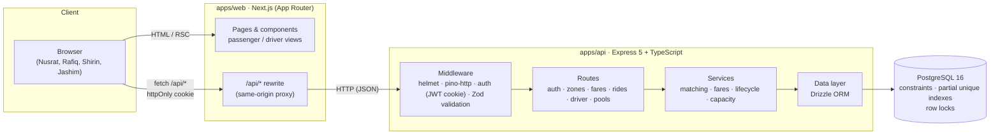
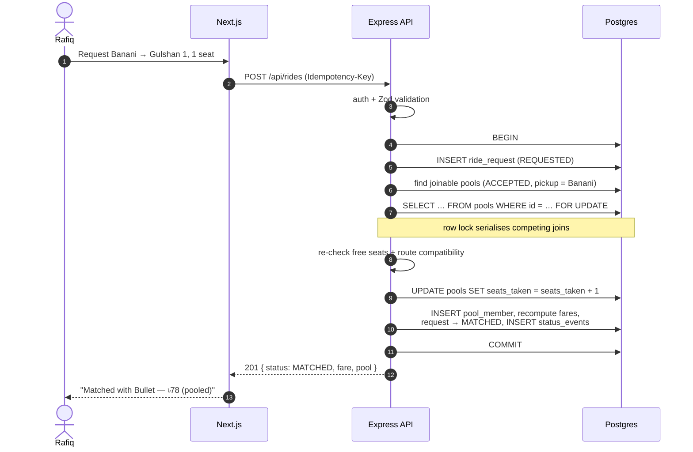
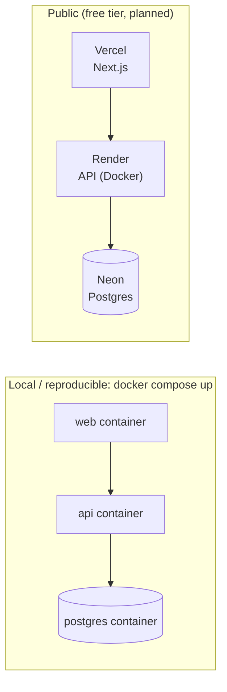

# Architecture

Dhaka Tesla Pool is a deliberately boring three-tier app: one Next.js frontend, one Node.js API, one
Postgres database. There is no Redis, queue, or WebSocket server — nothing in the MVP's load or
feature set needs them yet (see [Scaling notes](#what-changes-at-scale)).

## System diagram

### Why the browser talks to the API through Next.js

The planned deployment puts the web app and the API on different free-tier hosts (e.g.
`*.vercel.app` and `*.onrender.com`). If the browser called the API directly, the auth cookie would
be a third-party cookie, which modern browsers increasingly block. A Next.js rewrite of `/api/*` to
the API keeps every request same-origin, so the cookie can be `HttpOnly; Secure; SameSite=Lax` and
CORS is not needed at all.

## Layering inside the API

| Layer      | Responsibility                                                              | Must not                          |
| ---------- | --------------------------------------------------------------------------- | --------------------------------- |
| Routes     | Parse and validate input (Zod), call one service, shape the HTTP response   | Contain business rules            |
| Services   | Business rules: matching, fares, state transitions, ownership, transactions | Know about `req`/`res`            |
| Data layer | Drizzle schema and queries                                                  | Decide whether a transition is OK |
| Database   | Last line of defence: CHECKs, FKs, unique/partial indexes                   | —                                 |

Every rule that protects data integrity (capacity, one active ride per passenger, one active pool per
Tesla) is enforced **twice**: in the service, so users get a clear error, and in the database, so a
bug or a race can never write an invalid row.

## Request flow: Rafiq joins Nusrat's pool

The full matching and locking rules are in [pooling-and-fares.md](pooling-and-fares.md).

## Status updates: polling, not WebSockets

Passenger and driver screens poll their current ride/pool every few seconds. At MVP scale this costs
almost nothing, works through every proxy and free-tier host, and keeps the API stateless. Server-Sent
Events or WebSockets are the upgrade path once polling load or latency matters.

## Deployment

`docker compose up` is the reference environment: it runs migrations and seeds the story cast before
the API starts. The public deployment uses the same API image. Free-tier caveat: Render free services
sleep after inactivity, so the first request can take ~30–60 s.

## What changes at scale

The MVP keeps all matching inside a single Postgres transaction per request. That is correct and
simple, but it serialises writes per pool and puts all load on one primary. The viral-scale bonus in
the README covers the next steps (geospatial indexing, per-zone matching workers, read replicas,
real-time push, idempotency at the gateway, observability).
