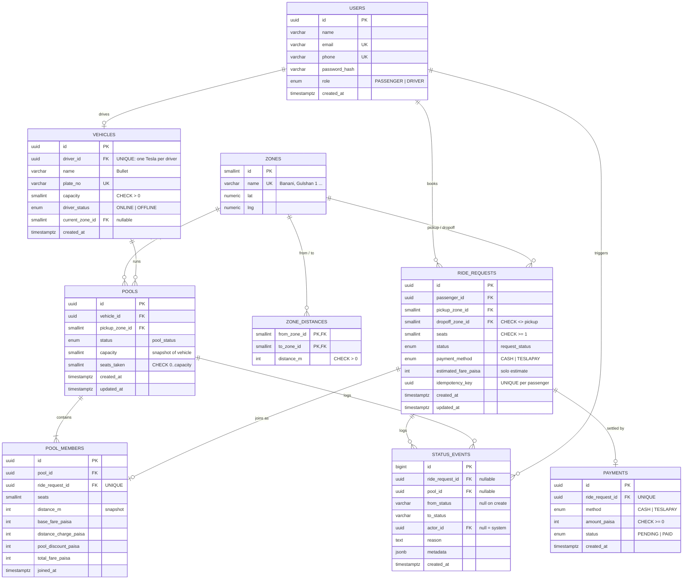

# Database design

PostgreSQL 16, managed with Drizzle migrations. Money is stored as **integer paisa** (৳1 = 100
paisa): exact arithmetic, no floating-point drift, maps to a plain `integer` and serialises to JSON as
a number. `numeric` would also be exact, but the driver returns it as a string and every calculation
would need a decimal library.

## ERD

## Tables

**`users`** — everyone who signs in. `role` decides which half of the app you see. Passengers and
drivers share one table because they share auth; driver-only data lives on `vehicles`. `email` is the
login identifier; `phone` is unique because in Dhaka it is the real-world identity.

**`vehicles`** — a Tesla (Bullet) and its fixed `capacity`. `driver_id` is unique: one Tesla per
driver. `driver_status` and `current_zone_id` live here rather than on `users` because they only mean
something for a driver with a vehicle; being 1:1 with the driver, this costs nothing.

**`zones`** — the predefined Dhaka areas (Banani, Gulshan 1, Mohakhali, …). `lat`/`lng` are there for
display only; no routing uses them.

**`zone_distances`** — curated road distance between two zones, stored in **both directions** so a
lookup is a simple primary-key hit. Curated values (not haversine) keep fares hand-checkable.

**`ride_requests`** — one passenger's trip. This is where _per-passenger_ status lives: Rafiq can
cancel their request without affecting Nusrat's. `estimated_fare_paisa` is the solo quote shown before
matching. `idempotency_key` makes "tap Request twice on bad 3G" create one ride, not two.

**`pools`** — one trip of one Tesla from one pickup zone, holding one or more requests. This is where
_per-trip_ status lives (arrived, started, completed). `capacity` is copied from the vehicle when the
pool is created so later vehicle edits can't retroactively break a pool. `seats_taken` is a
deliberate denormalisation of `SUM(active members' seats)`: it is the single row every seat claim
locks (`SELECT … FOR UPDATE`) and updates, which is what makes the capacity check race-free (see
[pooling-and-fares.md](pooling-and-fares.md#concurrency-the-last-seat)).

**`pool_members`** — joins a request to a pool and stores that passenger's **fare breakdown** plus the
`distance_m` it was based on. Storing the components (not just the total) is what lets us "explain
exactly what happened" later, even if pricing constants or zone distances change.

**`status_events`** — append-only audit log. Every transition of a request or pool writes one row in
the same transaction as the transition itself: who (`actor_id`, null for system actions like
auto-matching), from/to, why (`reason`), and context (`metadata`, e.g. the fare snapshot at
completion). Status columns on `ride_requests`/`pools` are the fast "current state"; this table is the
history.

**`payments`** — one per completed request. Cash and TeslaPay are both simulated: the row is created
on completion and marked `PAID`.

## Constraints and indexes

| Rule                                            | Enforced by                                                                                   |
| ----------------------------------------------- | --------------------------------------------------------------------------------------------- |
| Occupied seats never exceed capacity            | `CHECK (seats_taken BETWEEN 0 AND capacity)` on `pools` + `SELECT … FOR UPDATE` (service)     |
| A vehicle has positive capacity                 | `CHECK (capacity > 0)` on `vehicles` and `pools`                                              |
| A request asks for at least one seat            | `CHECK (seats >= 1)`; "≤ vehicle capacity" checked in the service                             |
| Pickup and dropoff differ                       | `CHECK (pickup_zone_id <> dropoff_zone_id)`                                                   |
| One Tesla per driver                            | `UNIQUE (driver_id)` on `vehicles`                                                            |
| A request is in at most one pool                | `UNIQUE (ride_request_id)` on `pool_members`                                                  |
| One active ride per passenger                   | partial `UNIQUE (passenger_id) WHERE status NOT IN ('COMPLETED','CANCELLED')`                 |
| One active pool per Tesla                       | partial `UNIQUE (vehicle_id) WHERE status NOT IN ('COMPLETED','CANCELLED')`                   |
| Retries don't duplicate rides                   | `UNIQUE (passenger_id, idempotency_key)`                                                      |
| Every audit event belongs to exactly one entity | `CHECK (num_nonnulls(ride_request_id, pool_id) = 1)`                                          |
| Fares are sane                                  | `CHECK (total_fare_paisa = base + distance_charge - pool_discount)` and all components `>= 0` |
| One payment per request                         | `UNIQUE (ride_request_id)` on `payments`                                                      |

| Index                                         | Serves                                 |
| --------------------------------------------- | -------------------------------------- |
| `ride_requests (status, pickup_zone_id)`      | Driver's "requests near me" feed       |
| `ride_requests (passenger_id, created_at)`    | Passenger ride history                 |
| `pools (status, pickup_zone_id)`              | Finding joinable pools during matching |
| `pools (vehicle_id, created_at)`              | Driver ride history                    |
| `status_events (ride_request_id, created_at)` | Request timeline                       |
| `status_events (pool_id, created_at)`         | Pool timeline                          |

Foreign keys use `ON DELETE RESTRICT`: rides are history, and history is never cascade-deleted.

## Changes from the first ERD draft

- **Dropped `pools.version`** (optimistic lock). Capacity is protected by locking the pool
  row (`SELECT … FOR UPDATE`), re-checking, then updating — plus the CHECK constraint. Two mechanisms guarding the
  same invariant would be one too many to explain.
- `ride_requests.seats` went from `CHECK 1..3` to `CHECK >= 1`: "3" was Bullet's capacity leaking into
  the schema.
- Added the two partial unique indexes (one active ride per passenger, one active pool per Tesla).
- `idempotency_key` is unique per passenger instead of globally.
- `status_events` gained a one-entity CHECK, nullable `actor_id` for system actions, and `metadata`.
- `pool_members` gained a `distance_m` snapshot; `ride_requests` gained `payment_method`.
