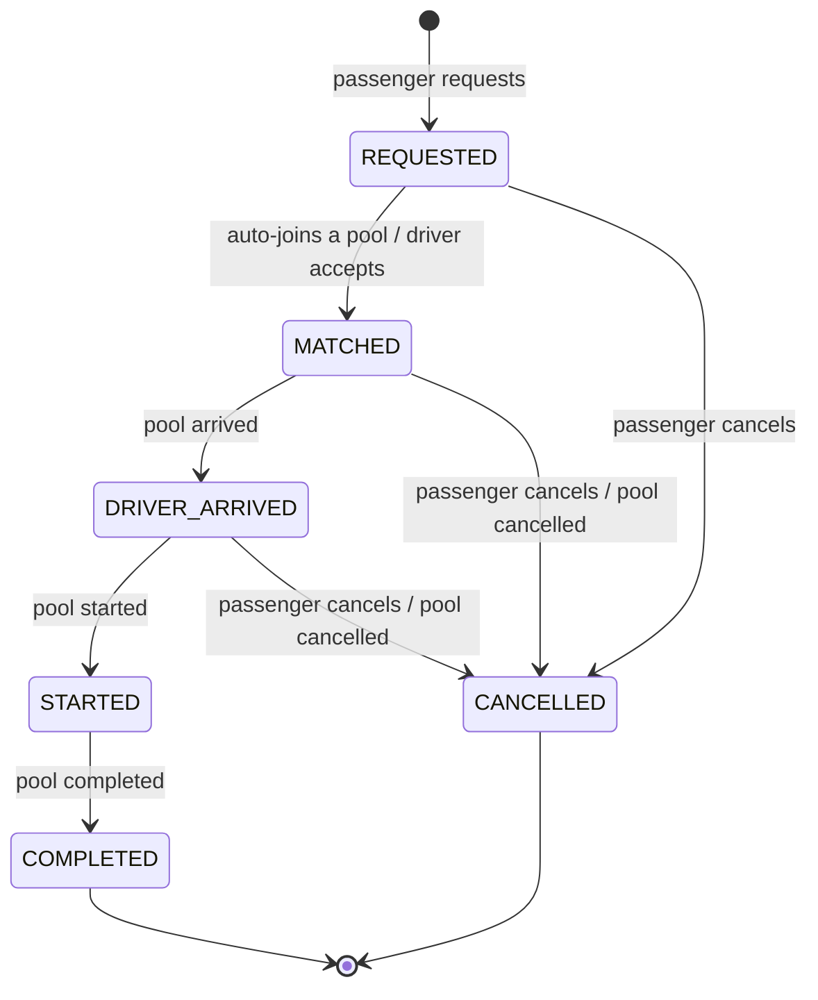
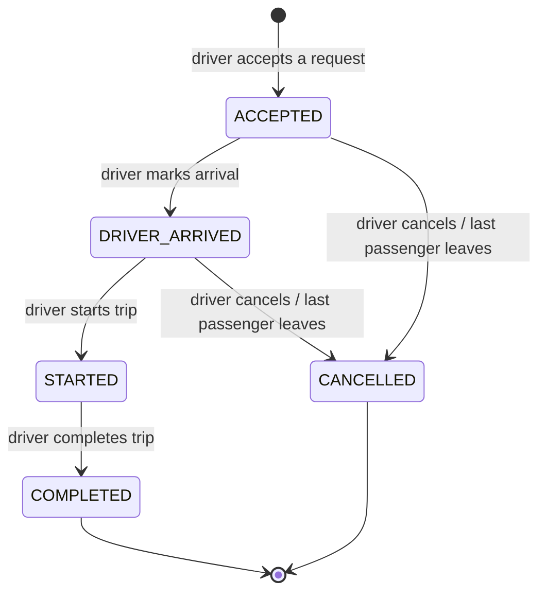

# Ride and pool lifecycle

The PRD suggests one lifecycle: `REQUESTED → MATCHED/ACCEPTED → DRIVER_ARRIVED → STARTED →
COMPLETED (+ CANCELLED)`. We split it into **two state machines** — one per passenger request, one
per Tesla trip — because a pool holds several requests:

- Rafiq cancelling must not cancel Nusrat's ride, so status can't live only on the pool.
- Jashim tapping "Start" must move every passenger at once, so status can't live only on requests.

The pool drives the shared stages; each request mirrors its pool and can only leave early by
cancelling.

## Ride request (per passenger)

| From             | To               | Triggered by                          |
| ---------------- | ---------------- | ------------------------------------- |
| —                | `REQUESTED`      | Passenger (owner)                     |
| `REQUESTED`      | `MATCHED`        | System (auto-join) or driver (accept) |
| `MATCHED`        | `DRIVER_ARRIVED` | Cascade from pool                     |
| `DRIVER_ARRIVED` | `STARTED`        | Cascade from pool                     |
| `STARTED`        | `COMPLETED`      | Cascade from pool                     |
| `REQUESTED`      | `CANCELLED`      | Passenger (owner)                     |
| `MATCHED`        | `CANCELLED`      | Passenger (owner) or pool cancelled   |
| `DRIVER_ARRIVED` | `CANCELLED`      | Passenger (owner) or pool cancelled   |

## Pool (per Tesla trip)

| From             | To               | Triggered by                         | Side effects                                              |
| ---------------- | ---------------- | ------------------------------------ | --------------------------------------------------------- |
| —                | `ACCEPTED`       | Driver (online, same zone)           | Accepted request → `MATCHED`                              |
| `ACCEPTED`       | `DRIVER_ARRIVED` | Driver (owner)                       | Active members → `DRIVER_ARRIVED`; pool closes to joins   |
| `DRIVER_ARRIVED` | `STARTED`        | Driver (owner)                       | Members → `STARTED`; **fares are frozen**                 |
| `STARTED`        | `COMPLETED`      | Driver (owner)                       | Members → `COMPLETED`; one `payments` row per member      |
| `ACCEPTED`       | `CANCELLED`      | Driver (owner), or system when empty | Active members → `CANCELLED` (reason: "driver cancelled") |
| `DRIVER_ARRIVED` | `CANCELLED`      | Driver (owner), or system when empty | Same as above                                             |

## Rules

1. **One function performs every transition.** `transition(entity, to, actor)` looks up the allowed
   `from → to` map, checks the actor may perform it, updates the row with
   `WHERE id = $1 AND status = $expectedFrom`, and inserts a `status_events` row — all in one
   transaction. If the conditional update touches 0 rows, someone else changed the state first and
   the caller gets `409 INVALID_TRANSITION`. Anything not in the map (e.g. `COMPLETED → STARTED`) is
   rejected the same way.
2. **Pools accept new passengers only while `ACCEPTED`.** Once Jashim has arrived, passengers are boarding
   at the kerb; adding strangers at that point would make the driver's "who's actually riding" view
   unstable.
3. **Passengers can cancel until the trip starts** (`REQUESTED`, `MATCHED`, `DRIVER_ARRIVED`). After
   `STARTED` they are physically in the Tesla. Cancelling releases their seats and recomputes the
   remaining members' fares. No cancellation fee in the MVP.
4. **An empty pool cancels itself.** If the last member cancels before the trip starts, the system
   moves the pool to `CANCELLED` so Bullet is free to accept again.
5. **A driver cancelling a pool cancels its requests**, rather than silently re-queueing them. The
   passenger sees why (the event `reason`) and can request again. Re-queueing is a listed
   improvement.
6. **A driver cannot go offline with an active pool.**
7. **Ownership:** a passenger acts only on their own requests, a driver only on pools of their own
   vehicle. Other people's rides return `404`, not `403`, so the API doesn't confirm they exist.

## The story, as transitions

| Time | Event                                                  | Nusrat           | Rafiq            | Shirin      | Bullet's pool           |
| ---- | ------------------------------------------------------ | ---------------- | ---------------- | ----------- | ----------------------- |
| 8:41 | Nusrat requests Banani → Mohakhali, 1 seat             | `REQUESTED`      |                  |             | —                       |
| 8:41 | Jashim accepts                                         | `MATCHED`        |                  |             | `ACCEPTED` 1/3          |
| 8:43 | Rafiq requests Banani → Gulshan 1, 1 seat → auto-joins | `MATCHED`        | `MATCHED`        |             | `ACCEPTED` 2/3          |
| 8:43 | Shirin requests Banani → Gulshan 1, **2 seats**        | `MATCHED`        | `MATCHED`        | `REQUESTED` | `ACCEPTED` 2/3 (1 free) |
| 8:46 | Jashim arrives                                         | `DRIVER_ARRIVED` | `DRIVER_ARRIVED` | `REQUESTED` | `DRIVER_ARRIVED`        |
| 8:47 | Jashim starts — fares frozen                           | `STARTED`        | `STARTED`        | `REQUESTED` | `STARTED`               |
| 8:58 | Jashim completes                                       | `COMPLETED`      | `COMPLETED`      | `REQUESTED` | `COMPLETED`             |

Shirin is not rejected with an error: Shirin's request stays `REQUESTED` and visible to any other online
Tesla in Banani, which is what a real passenger would want.
