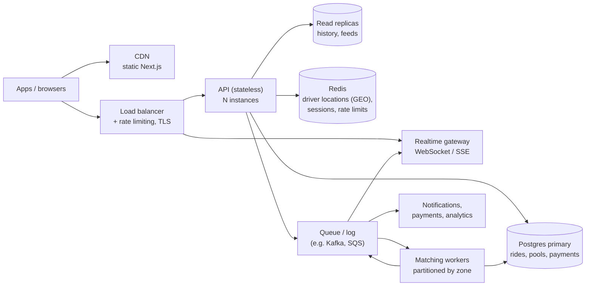

# If Oi Tesla goes viral: 1M passengers, 100k drivers

The MVP is one API, one Postgres, polling clients. That is the right design for a demo and for the
first few thousand rides a day. This is what we would change, in the order the pain would arrive —
not a plan to build it all up front.

## Rough numbers first

- 100k drivers online at peak, each polling or pushing location every ~5 s → **~20k writes/s** of
  location/heartbeat. This is the first thing that breaks a single Postgres.
- 1M passengers, say 10% booking in a two-hour rush → ~100k ride requests in 2 h ≈ **15 requests/s**
  average, a few hundred/s at the spikes. Matching writes are modest; **reads** (status polling,
  feeds) dominate: 100k active clients polling every 4 s ≈ **25k reads/s**.
- Contention is local: two people fighting over Bullet's last seat only ever compete with others in
  the same zone at the same minute.

So: location and status traffic need to leave the primary database; seat claims can stay
transactional as long as they're partitioned by zone.

## Target architecture

## What changes, and why

**Horizontal scaling + load balancing.** The API is already stateless (JWT cookie, no in-process
session), so it scales by adding instances behind a load balancer. The one piece of in-memory state
today — the auth rate limiter — moves to Redis so limits hold across instances.

**Geospatial search instead of zones.** Zones stop being enough: "Banani" is too coarse at scale.
Driver locations go into Redis `GEO` (or PostGIS / H3 cells) so "online Teslas within 1.5 km with a
free seat" is a radius query. Route compatibility graduates from "dropoffs within 3 km" to a detour
check against a routing service (OSRM/Valhalla self-hosted, or a paid API).

**Matching as partitioned workers.** Today matching runs inside the request transaction. At scale a
ride request is written, then an event goes onto a queue partitioned by zone/H3 cell. One matching
worker owns each partition, so seat claims for a zone are serialised by the queue rather than by
database row locks — no contention, and matching can batch (e.g. look 2 s ahead to pair Nusrat and
Rafiq optimally instead of first-come). Postgres remains the source of truth for committed
membership; the `CHECK (seats_taken <= capacity)` constraint and the pool row lock stay as the last
line of defence.

**Real-time instead of polling.** Status polling is the biggest read load. A WebSocket/SSE gateway
subscribes to ride/pool events from the queue and pushes "matched", "driver arrived", "fare changed".
Polling stays as a fallback for bad networks.

**Database.** Indexes already cover the hot queries (feed by `status, pickup_zone_id`; history by
`passenger_id, created_at`). Next: read replicas for history and driver feeds; partition
`status_events` and `ride_requests` by month (they are append-heavy and mostly read recently); move
driver heartbeats out of Postgres entirely. Connection pooling via PgBouncer once instance count
grows.

**Idempotency everywhere.** `POST /rides` already takes an `Idempotency-Key`. Extend the same pattern
to accept/arrive/start/complete and to payment calls, store keys with a TTL, and make every queue
consumer idempotent (at-least-once delivery means duplicates will happen).

**Retries and failure.** Retries with exponential backoff and jitter on transient errors only (a
`409 INVALID_TRANSITION` is not transient). Dead-letter queues for poison messages. Timeouts on every
outbound call. A request that no driver accepts expires after N minutes rather than waiting forever.
If matching workers are down, requests queue and are processed on recovery instead of being lost.

**Rate limiting and abuse.** Per-user and per-IP limits at the gateway (not just sign-in), stricter on
ride creation; device fingerprinting and phone verification to stop fake accounts booking and
cancelling to deny service to others.

**Observability.** Structured logs already carry a request id; add distributed tracing
(OpenTelemetry) across API → queue → workers, RED metrics per endpoint, and business metrics that
catch real problems: match rate, time-to-match, cancellation rate, seats-per-trip, p95 status latency.
Alert on those, not just CPU.

**Security.** Secrets in a secret manager; short-lived access tokens with refresh rotation (the MVP's
12 h JWT can't be revoked early); PII (phones) encrypted at rest and never logged; row-level
authorisation tests stay mandatory — "Rafiq can't see Nusrat's ride" matters more at 1M users.

**Deployment.** Containers on a managed orchestrator (ECS/Cloud Run/Kubernetes when justified),
blue-green or canary releases, migrations run as a separate expand-then-contract step so old and new
API versions can run side by side.

## What we would not do yet

Microservices per entity, multi-region active-active, or event sourcing. Each is a large tax on a
small team and none is required until a single region's primary database is genuinely the
bottleneck after replicas, partitioning and moving location data out.
